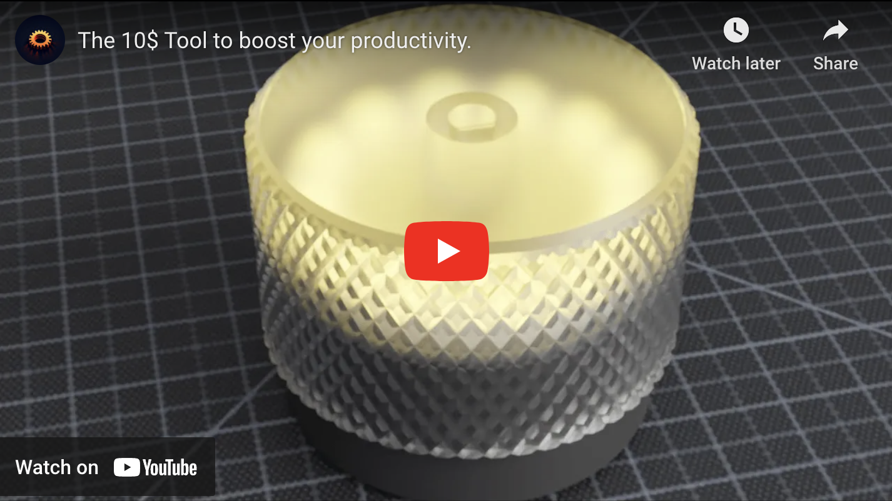
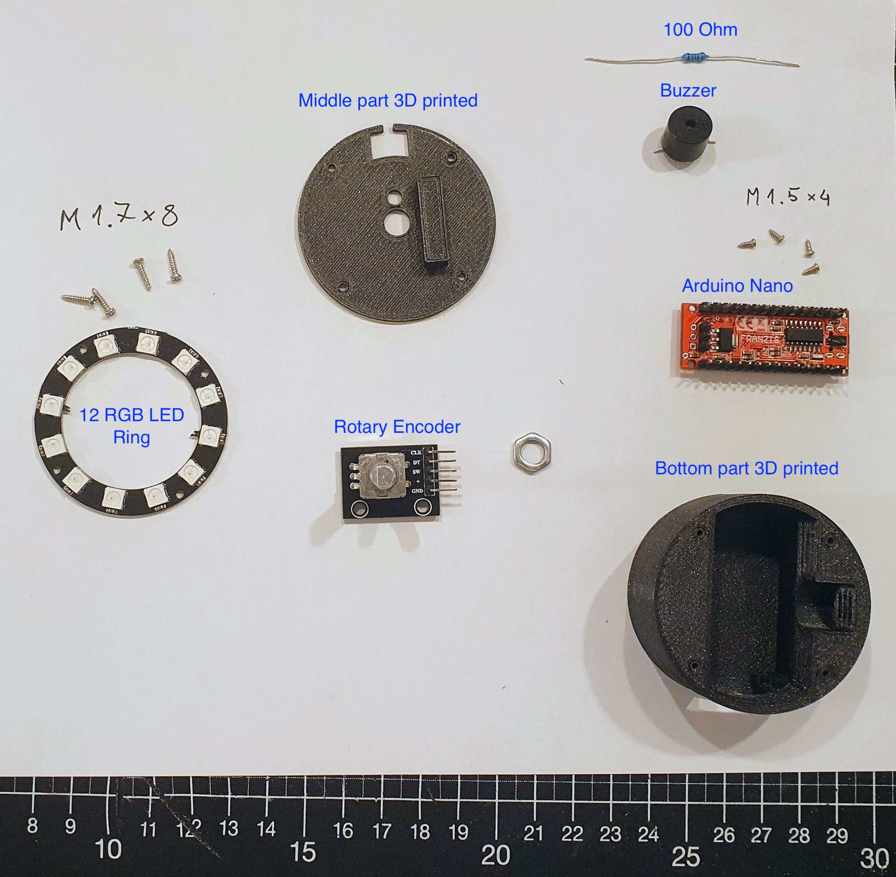
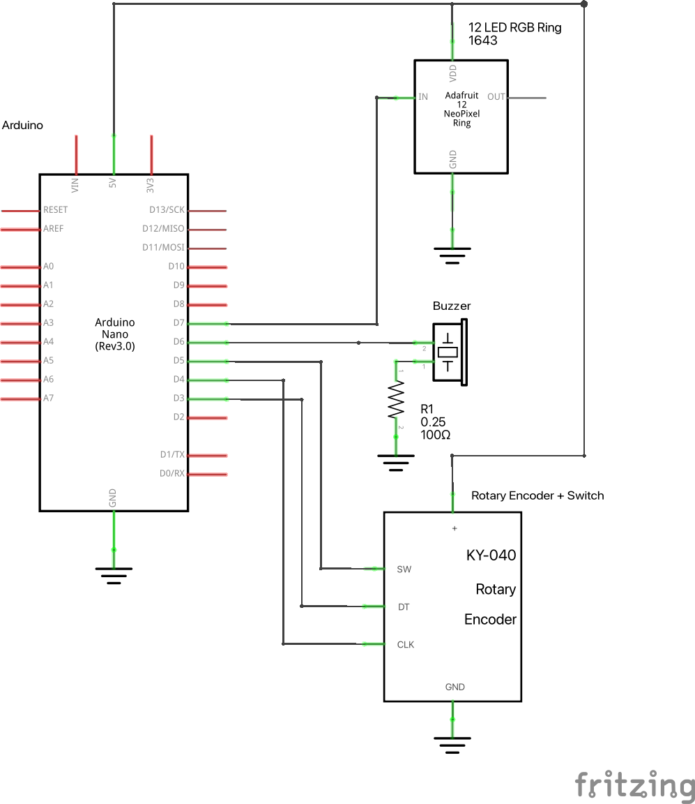
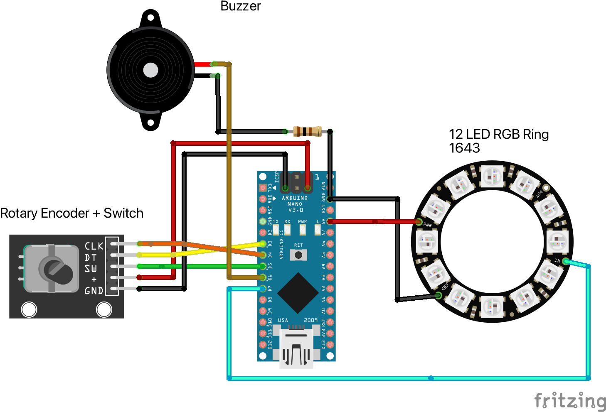
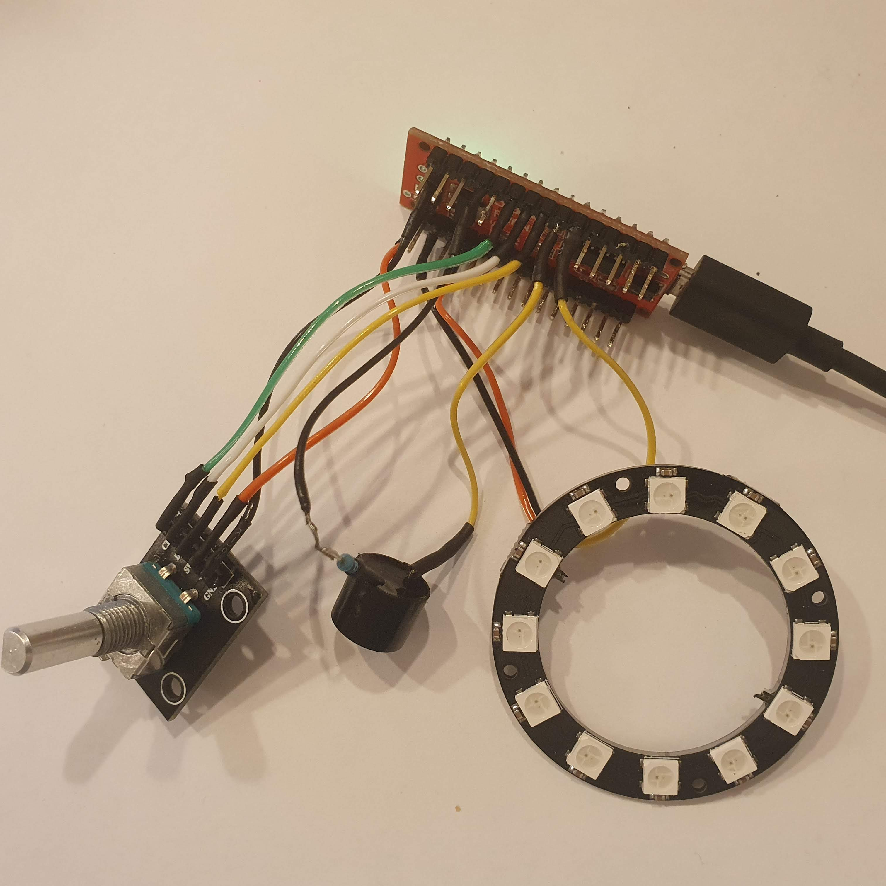

# Glow-Timer

Meet the Glow-Timer, a 3D-printed, open-source project that brings together the simplicity of a timer with the fun of LED lights and interactive user experience.

## 3D printable parts

## Bill of Materials: 

- Arduino Nano
- LED Ring 5V RGB WS2812B 12-Bit 50mm
- KY-040 Rotary Encoder Rotary Encoder Module
- Active Buzzer module with two pins
- 4 Screws  M1.7 x 8 
- 4 Screws  M1.5 x 4

Note: almost every part is included in a arduino nano kit so consider buying that one for around 20$ (It will help you in future projects)

## Schematics

## Wiring

## Soldered
